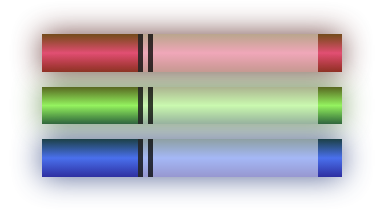

# color-markers

A simple webpage with color markers designed using CSS.

**Live Demo:** [https://oendemann.github.io/color-markers/]

---

---

## About The Webpage

Another project created from a freeCodeCamp course. This course mostly focused on differnt ways to design a webpage with color (eg hexidecimal, hsl, rgb).

---

## Built With

* **HTML:** Used for the structure/format of the text and markers.
* **CSS:** Used for the color, opacity, shadows, and other design features of the markers.

---

## What I Learned

1. It was mostly a reminder of how basic color concepts, like secondary colors, primary colors, creating colors using hexidecimal and rgb, etc.
2. Taught how to use hsl and other more detailed design features, such as opacity, using CSS.

---

## Acknowledgments

* Project idea and requirements from [freeCodeCamp.org](https://www.freecodecamp.org/)